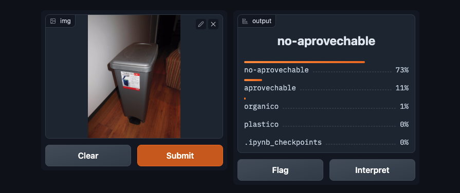

# Recolector-Inteligente
Aplicación para la clasificación de cubos de reciclaje.

Puede ser confuso saber qué residuos van en qué contenedor. Muchas empresas, cafés y espacios al aire libre ofrecen contenedores de basura, reciclaje y compostaje, lo que requiere que los consumidores descifren el texto instructivo, los íconos o las imágenes para clasificar sus desechos con precisión. Además, diferentes ubicaciones pueden tener diferentes reglas sobre cómo separar los desechos y, a menudo, las personas arrojan su basura sin darse cuenta en el contenedor equivocado. Las soluciones de aprendizaje automático pueden ayudarnos a elegir de manera más rápida y precisa el recipiente adecuado para nuestros desechos al clasificar una fotografía de los contenedores. Sobre la base del trabajo reciente en el aprendizaje profundo y la clasificación de contenedores de desechos, presentamos Recolector inteligente, una red neuronal convolucional que clasifica los contenedores de basura adecuadamente.

